# GitHub Contibuting Guide

Updated 2017-12-05

[< Git][0]

For ease of navigation, the installation is broken up into sections and can be jumped to by clicking any of the links below.

1. [Terminology](#required-software)
2. [Getting Started](#required-software)
3. [GitHub Basics (Website)](#required-software)
4. [GitHub Basics (Application)](#required-software)

## Intro
This is an introduction to GitHub and Git on the example of contributing to OpenAngelArena. Nearly all of the implementation (from KV files, localization, scripts, graphics, to models) can be streamlined by using a very basic software tool called a Version Control System (VCS). The one we're using is called Git and the repository (server storage) we are using is called GitHub. Essentially, Git enables the development teams to branch out and work on the exact same files as each other without overwriting each other's work. Also, every person can have multiple development branches of the same files available simultaneously using only a couple very basic commands. This enables one to modify files in a development branch without effecting the others (like if you wanted to test abilties you script but didn't want to have to overwrite and manually back up everytime you change something). Furthermore, Git tracks history, so if you make a mistake, you can just reset to ANY point in the development (even if you delete files). Yes it's going to take some effort to learn.

## Terminology
At this point just familiarize yourself with the following terminology:

- `Add` - Move changes from the working directory to the staging area.
- `Branch` - A branch represents an independent line of development.
- `Checkout` - Switches between branches.
- `Clean` -  Removes untracked files
- `Clone` - Creates a copy of an existing Git repository.
- `Commit` - Takes the staged snapshot and commits it to the project history. (Add - Commit)
- `Fetch` - Downloads a branch from another repository, without integrating it into your local repository.
- `Forking` - Gives any contributor a server-side repository.
- `Git` - Version control system (VCS) for tracking and coordination 
- `GitHub` - A collaborative software development environment based on the Git VCS.
- `GitHub Desktop` - Software designed for users to manage their GitHub.
- `Init` - Initializes a new local repository.
- `Local` - The local repository.
- `Master` - The default development branch. Whenever you create a git repository, a branch named master is created, and becomes the active branch.
- `Origin` - Alias for the URL of the remote repository.
- `PowerShell` - A command-line interface for Git in Windows.
- `Pull Request` - Provides interface for discussing proposed changes before integrating them into the official project.
- `Push` - Push commits from one repository to another.
- `Remote` - The remote repository.
- `Repository` - A collection of commits, branches, and tags.
- `Snapshot` - Current state or content of something.
- `Staging` - Marking files the user wishes to commit.
- `Tag` - Marks a particular point in the commit chain.
- `Tracked files` - Any files that were in the latest snapshot.
- `Untracked files` - Unstaged files not in the last snapshot.

## Getting Started

### Setup

First, follow the [Installation Process](/docs/install.md) in order to create a Fork of openangelarena/oaa to work from.
If you do not already have a GitHub.com Account, create one [here](https://GitHub.com/join).

## Forking
As described in the Installation Process, forking creates a simultaneous instance of oaa within your own GitHub repository. During the Installation Process, you should have already done the following:
- Goto OpenAngelArena/oaa.
- Click Fork
- Choose where to Fork: Fork OpenAngelArena/oaa to YOURUSERNAME/oaa
- Done! If you go to `GitHub.com/YOURUSERNAME/oaa` you'll see your own fork of [OpenAngelArena/oaa].

### Cloning
Also described in the Installation Process, cloning copies your fork to your computer with the GitHub client (or by clicking "Clone or Download" on the main page of `GitHub.com/openangelarena/oaa`. As mentioned, you can do basic things with the GitHub Client, but you will want to familiarize yourself with the command-line. GitHub Client comes with a built-in version of PowerShell (a command-line interface which enables you to type Git commands). You should have already done the following during the Installation Process:

- Open the GitHub Client you installed earlier in [install.md](/docs/install.md).
- Click settings.
- Change the settings how you like it (e.g. Change to Dark mode).
- While in settings, changing the default shell to PowerShell.
- Click Save.
- Click on the "+" in the upper left corner.
- Select Clone.
- Select your Account and the forked `oaa` repository.
- Clone your repo to \dota 2 beta\addons
- Verify Clone to your repo.
Now we should have a local copy of your fork of [OpenAngelArena/oaa]

### Open Git Power Shell
Git Power Shell enables you to control Git using a variety of commands. You can open Git Power Shell in a number of ways:
  - Desktop shortcut labelled Git Shell.
  - Startmenu shortcut labelled Git Shell.
  - CMD `%USERPROFILE%\AppData\Local\GitHub\GitHub.appref-ms --open-shell`
  - Right-Click on your repository at 'GitHub.com/YOURUSERNAME/oaa' and select `Open in Git Shell`

 
### Finish Installing oaa
Continue the [Installation Process](/docs/install.md) from the beginning of this tutorial after the "Get the Addon" section (we're skipping that section entirely).

### Getting Started
To be able to work on your own stuff but still have all the newest changes and to have a nice and organized repository, git features Branches. For more information about Branches, read [Git Branching - Branches in a Nutshell](https://git-scm.com/book/en/v2/Git-Branching-Branches-in-a-Nutshell).

#### Remotes and Updating

Let's first look at the different remotes we have by typing 'git remote -v':
  ```
   git remote -v
  origin  https://GitHub.com/YOURUSERNAME/oaa (fetch)
  origin  https://GitHub.com/YOURUSERNAME/oaa (push)
  ```
We start out with one remote named "origin". That's our Fork that we made from before.

In order to stay up-to-date with the official OpenAngelArena/oaa (the official one), just add another remote like this:
 ```
  git remote add OpenAngelArena https://GitHub.com/OpenAngelArena/oaa
 ```
 You do not have to call this Remote OpenAngelArena, you can call it whatever you want. Now let's get the newest changes from [OpenAngelArena/oaa]:
  ```
   git pull OpenAngelArena master
  From https://GitHub.com/OpenAngelArena/oaa
   * branch            master     - FETCH_HEAD
  Already up-to-date.
  ```
#### Pushing
When updating, the newest changes are downloaded from OpenAngelArena/oaa to our [local] [master] [branch]. Now push them to your repo YOURUSERNAME/oaa on GitHub:
```
 git push
Everything up-to-date
```

### Workflow
When working, you want to keep two Branches. The first is your local master branch. Switch to it using:
```
 git checkout master
Your branch is up-to-date with 'origin/master'.
Switched to branch 'master'
```
Before changing any of the files, you should create and switch to your new branch:
```
 git checkout -b awesome-branch
Switched to a new branch 'awesome-branch'
```
Now you can do your changes!

To commit your changes you can either use GitHub Desktop or do
```
 git commit YOUR CHANGED FILES -m "WHAT YOU CHANGED" -m "A OPTIONAL EXTENDED DESCRIPTION"
[GitHub-for-noobs 3be214d] more changes
 1 file changed, 19 insertions(+)
```

or you add all files to the commit
```
 git add YOUR CHANGED FILES
```
and commit all of them together
```
 git commit -m "WHAT YOU CHANGED" -m "A OPTIONAL EXTENDED DESCRIPTION"
```

Now push your changes to GitHub
```
 git push
Counting objects: 4, done.
Delta compression using up to 4 threads.
Compressing objects: 100% (4/4), done.
Writing objects: 100% (4/4), 600 bytes | 0 bytes/s, done.
Total 4 (delta 3), reused 0 (delta 0)
remote: Resolving deltas: 100% (3/3), completed with 3 local objects.
To https://GitHub.com/Chronophylos/oaa
   1554bf2..3be214d  GitHub-for-noobs - GitHub-for-noobs
```

### Creating a PR

To create a PR goto [OpenAngelArena/oaa](https://GitHub.com/OpenAngelArena/oaa) on GitHub
- Click 'New Pull Request'
- Click `compare across forks`
- Click `head fork` and choose your Repository
- Click `compare` and select your Branch
- Now fill in the form
- 'Create pull request' and you're done!


## GitHub Basics (Website)
### Forking
> A fork is a copy of a repository. Forking a repository allows you to freely experiment with changes without affecting the original project.

  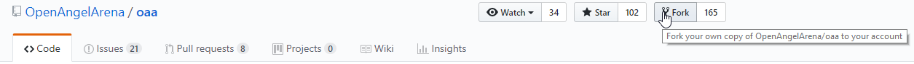

You MUST Fork the OAA repository to your account in order to do any form of development, as new users cannot write directly to the master repository at all.

### Making A Pull Request
> A pull request is the method by which you ask for a set of changes you have made to be integrated into the selected repository.

  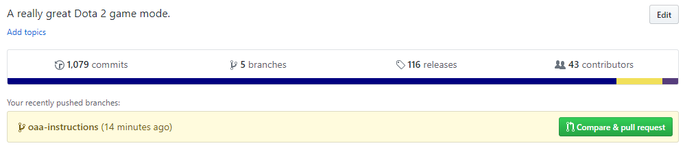
  
  ---
  
  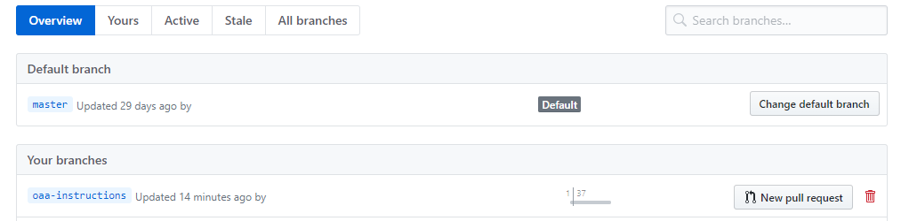
  
Making a pull request starts from the branch where your work is being done in.  You can see any freshly changed branches on your repository fork on GitHub, or you can see it from the branches view, where all branches are listed.
  
  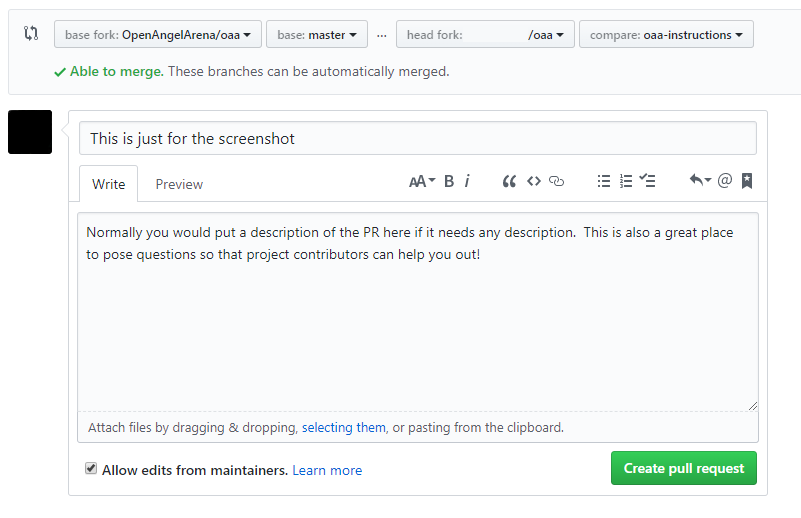


By default, this is the only way to make changes to Open Angel Arena.  This process will integrate directly into any testing capability that has been built for Open Angel Arena, allow project contributors to suggest changes or fixes and allow for general discussion.  A Pull request can only be merge into Open Angel Arena by core contributors.

## Git Basics (Application)

The Windows GitHub client is a good place to view your changes if you are not used to using git through the CLI (There is a CLI walkthrough [here](#manual-installation-of-oaa).  The following will go through the complete process, from the GitHub application, of making a code change and getting it to the point where you may make a Pull Request.

### What the heck is a remote?
>To better aid terminology later on, I am going to take a moment to explain remotes here.  If you understand what a remote is, and their general naming purpose, then you may skip this and move on.

>Remotes are the short term for `Remote Repository` and are used to describe any repository that **IS NOT THE ONE YOU ARE CURRENTLY ON**.

By default, remote repositories in specific relations to the current repository are given very specific names, and their descriptions are as follows:
- **Origin**: The origin remote is the name of the repository that you cloned from.  This, in OAA, is the fork you created when doing the initial setup steps.
- **Upstream**: The upstream remote is the name of the next nearest branch sitting above whatever fork you have created.  This, in most cases, is the actual master repository, but bear in mind that this is not always the case (Especially in large projects with many groups separated into intermediate repositories).

Though these names have special meaning in Git, they are not hard-set, meaning that you may rename remotes as needed if there is a workflow where **Origin** and **Upstream** might cause confusion.  From here on out, I will refer to `Remote Repositories` as simply `Remotes`

### What is a branch and why are you asking me to make one for EVERY FEATURE?
>A branch in Git is simply a lightweight movable pointer to one of these commits. The default branch name in Git is master. As you initially make commits, you’re given a master branch that points to the last commit you made. Every time you commit, it moves forward automatically.

Branches act as a way to maintain several sets of changes to the same repository without them being in the same set of history (And all coming over as a giant clump when a Pull Request is made).  This allows you to make small, specialized sets of changes, additions and fixes without all of them running together when you go to make a Pull Request.  As a good general rule of thumb, you should make a new branch for every new feature, fix or addition and not work on the master branch so you can have a place to start new branches without changes that have yet to be incorporated into Open Angel Arena.

  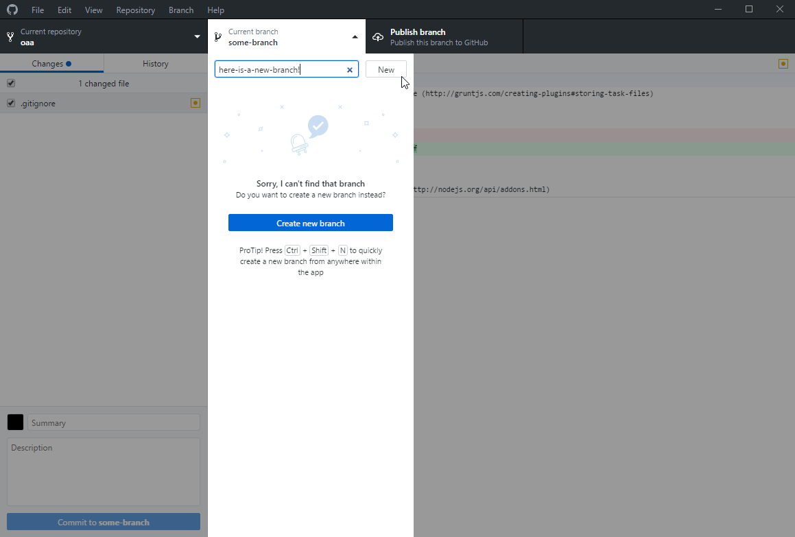
Creating a new branch is as simple as going to the text field next to `New`, typing in a name and clicking the new button.  You will be prompted what branch to base your new one on.  Almost every time you get this prompt, `Master` is the branch you want, as other branches may have unmerged changes that you don't want to deal with.

Branches may be published at any time (Sent to GitHub so it may be Pull Requested) by clicking on `Publish branch` in the main bar of the application.

  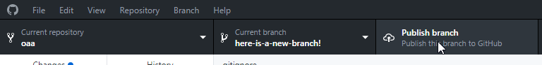
  
### Syncing your master with the master OAA repository

>It is generally a good idea to keep your repository as up-to-date as possible.  This will allow the test suite tools like Travis to better check your code and prevent any problem from showing up as a result of all of the other changes constantly happening.

In order to perform more complex or advanced tasks, you will need to be comfortable with typing commands into the command prompt.  If you are not comfortable with that, then you MUST USE BRANCHES FOR EVERY CHANGE!  If you do not, there is no method in the application to reset those changes away.

  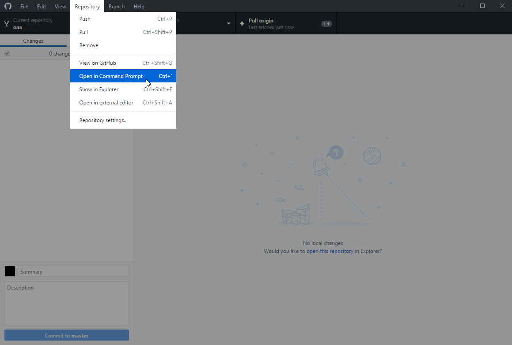
  
Using the menu in the application will open either a PowerShell instance or a command prompt instance in your repository, so you can get to entering commands immediately.  In order to pull the master repository, you can simply run the following:

- `git pull upstream master`

IF YOU ARE NOT ABLE TO PULL, PLEASE SEE THE FOLLOWING SECTION ON RESETTING YOUR BRANCH.

  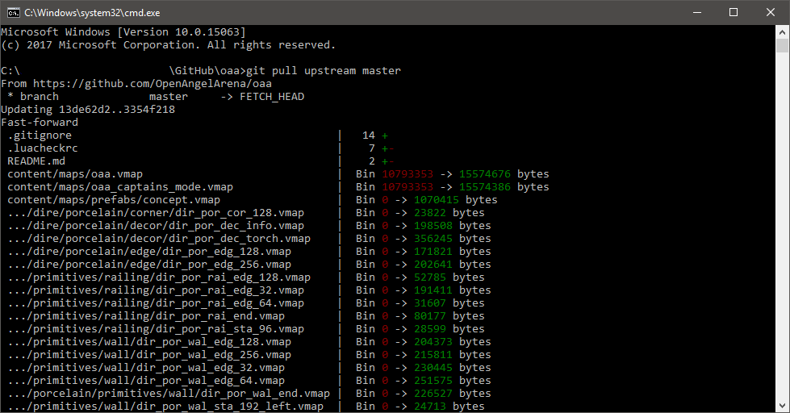
  
  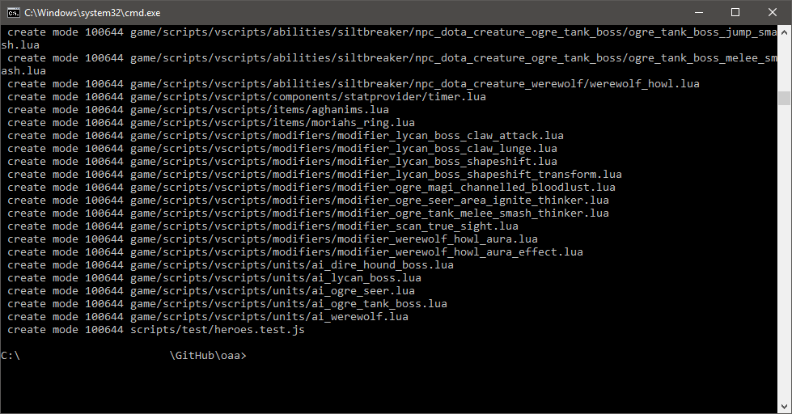
  
The console output will vary, but anything looking even remotely like what is shown indicates there was a success.  Any errors will be stated at the end of the command output.

### Resetting your branch so it is in sync with the master OAA repository
>This process will bring your master branch up-to-date with the master OAA repository, meaning the changes you make will be in the same state as an immediate merge.  This ensures your code will not be as affected by the changes of others.

Resetting your master branch is NOT something that you can accomplish in the application and is NOT a reversible process.  Once reset, any changes you have made on your master branch are gone.  open up the command prompt in the same manner that is shown from the application in the above section and run the following commands IN ORDER:

- `git fetch upstream master`
- `git reset --hard upstream master`

  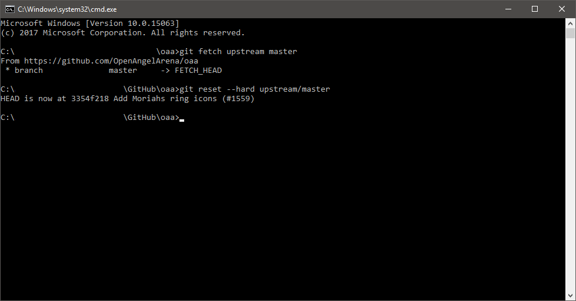

### Viewing the changes you have made

  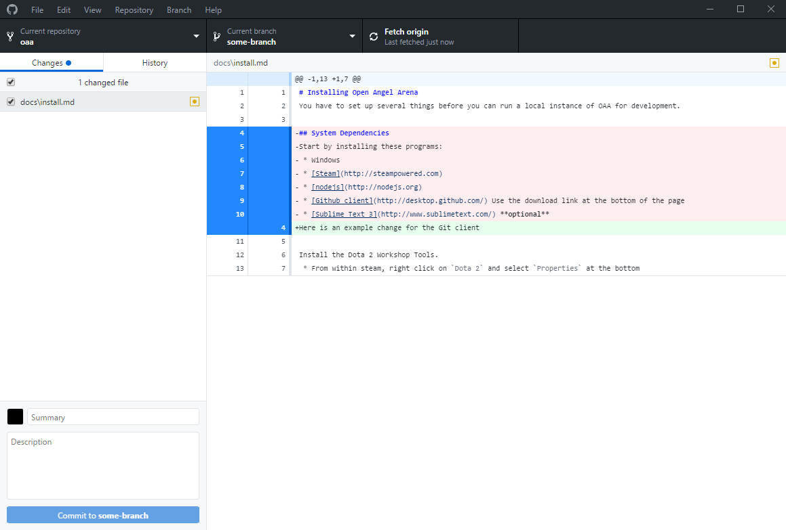

By default, the changes you have made to OAA will show up in the application window under the `Changes` list.  When viewing changes, red indicates items that have been removed, green indicates items that have been added and yellow indicates items that have been modified (All 3 are visible in the screenshot.  There were lined added and removed from a file, which had been modified).

  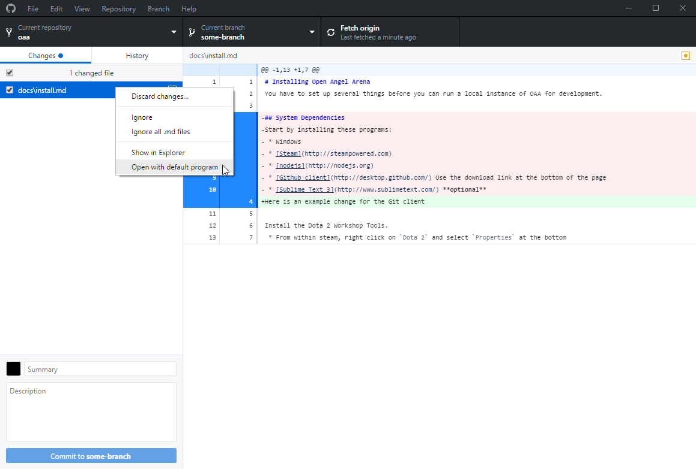
  
There is a right-click menu of options that you have on the files list if you need to make additional changes or slight amendments to files.  This is not the best way to actually modify files, as **ONLY CHANGED FILES WILL SHOW UP**, but it is good to be able to correct a mistake before making a commit.  Please keep in mind that, unless you want to learn the command line interface, **commits are FINAL**.

  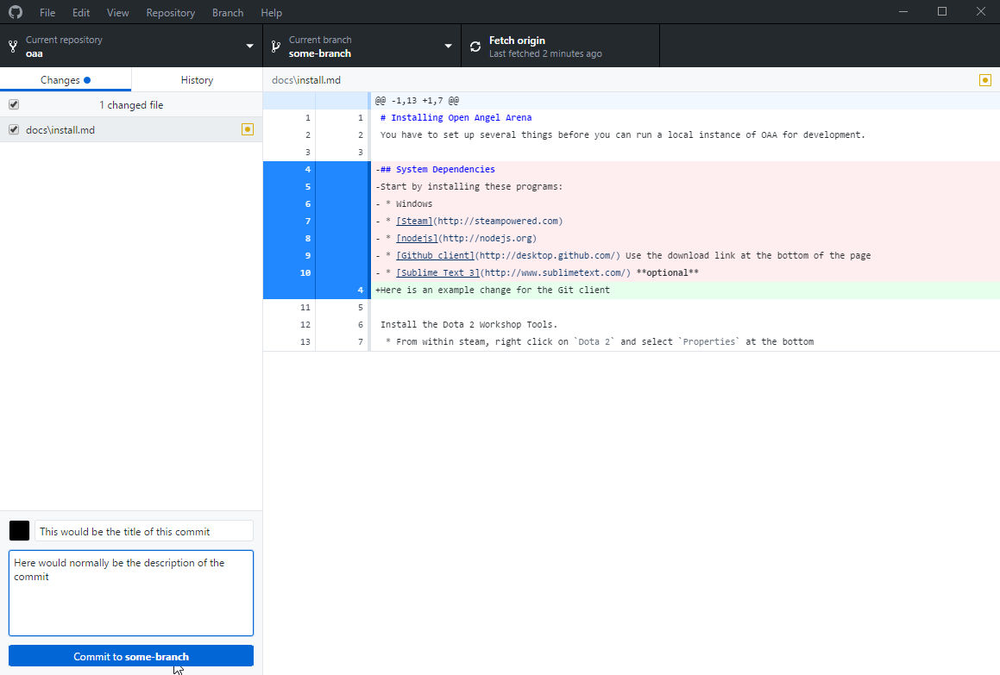
  
At the bottom left you have 2 text fields, one for a tittle and one for a description.  As a general rule of thumb, commit titles should be a very brief title for the purpose of a commit, like `Fix T1 core drops`.  The description is where you can get a bit more detailed if there is something that other developers need to be aware of.  In general this should be reserved for things like internal API changes and modifications that could break things for other people.  **Please do not re iterate what your code change does in the description.  If your code is straight forward or easy to look at and understand, putting a detailed description does not help you**

  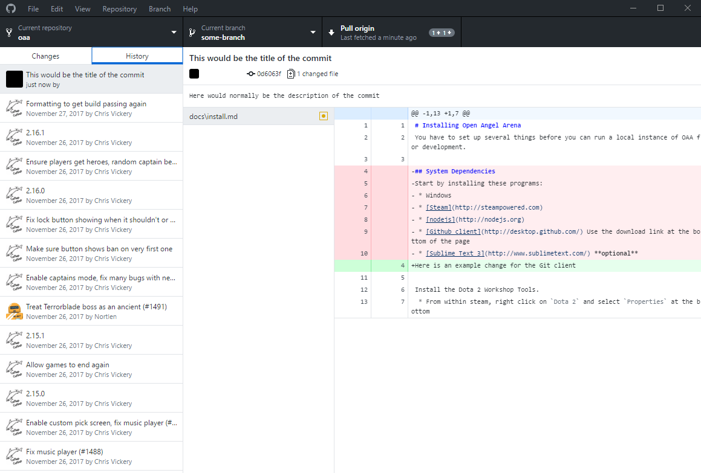
  
One a commit has been made, you will normally be automatically be taken to the `History` tab within the application.  This will allow you to see the commits and changes leading up to the latest commit made (There is a limit to the number of commits you can see.  If you need to look at a very old commit, please use the tools on the website).

  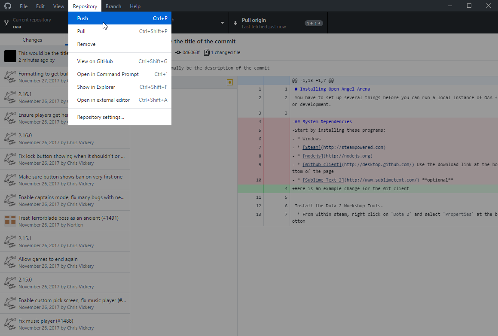

The repository menu up at the top bar of the application has several commands that will be of use when pushing and/or pulling code from Remotes.

- `Push` - This will attempt to push commits that have been made up to the remote you specify.
- `Pull` - This will attempt to pull, meaning to retrieve and incorporate, changes into the current branch.
- `Remove` - This will delete the repository.


- `View On GitHub` - This will open up the Fork you have created for yourself in your default Internet Browser.
- `Open in Command Prompt` - This will open up a Command Prompt window (Or PowerShell if you shoce PowerShell as the default command prompt during installation).
- `Show in Explorer` - This will open up the folder where the repository lives on your machine.
- `Open in External editor` - This will attempt to open up a program for editing the project.  By default, this will try to find Atom.

- `Repository Settings` - This will open a dialogue for modifying certain aspects of the Repository.

  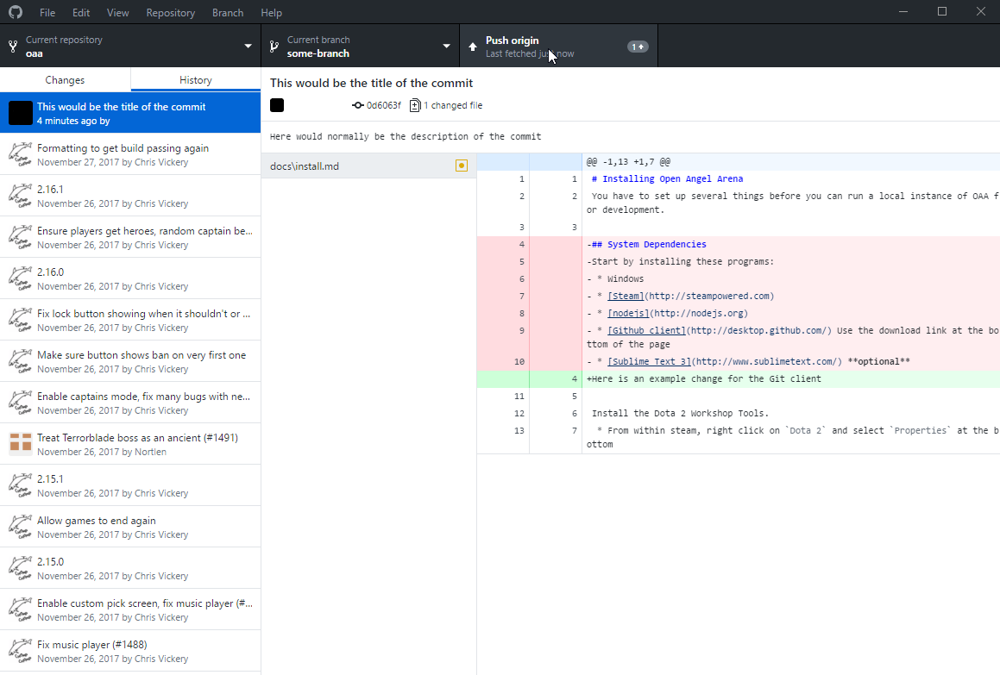
  
Once the application starts up, the origin Remote will have a quick-action button associated with it.  From here you can easily Fetch (Look for changes), pull and push to the Remote with a click.

  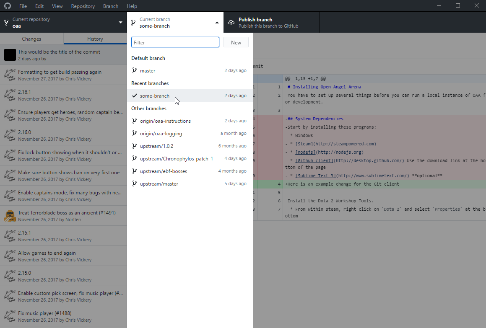
  
There is an easy link menu for going directly to the `Create a Pull Request` page on GitHub for the branch you are currently on.  The behavior of this is very contextual depending on a LOT of factors (The upstream Remote state, the origin Remote state and the branch state), so I will not go over what it will do once opened.

  
  
There is also a dialogue for creating and managing branches within your repository.  Use branches as a way of isolating features or other changes away from one another (Try to keep your work precise to what you want to fix.  It is generally bad practice to do a combination of fixes, features and tweaks that a completely unrelated in the same branch.  There is a point to doing several changes in one branch at once when it makes sense, such as a set of changes and tweaks to address a particular problem.  In that case, having many separate changes in one branch is fine.)


## Links
- [Read the entire Pro Git Book](https://git-scm.com/book/en/v2)!
- [Git on GitHub](https://GitHub.com/git/git)
- [Wikipedia](https://en.wikipedia.org/wiki/GitHub)
- [Git Questions?](https://stackoverflow.com/questions/tagged/git).
- [OpenAngelArena/oaa Master Repo](https://GitHub.com/OpenAngelArena/oaa)

### Authors
Author Discord@Chronophylos#5199
Editor Discord@Warpdragon#9105

[0]: README.md
