# Installing Open Angel Arena

Updated 2017-12-11

[\[< Setup\]](./)[0]

For ease of navigation, the installation is broken up into sections and can be jumped to by clicking any of the links below.

1. [Required Software](#required-software)
2. [GitHub Basics (Website)](#github-basics-website)
3. [Git Basics (Application)](#git-basics-application)
4. [Installing OAA](#installing-oaa)
5. [Manual installation of OAA (For CLI users or people who cannot get d2am working correctly)](#manual-installation-of-oaa)

## Required Software

#### 1. **[Steam](http://steampowered.com)**
#### 2. DOTA 2 Workshop Tools
- From within steam, right click on `Dota 2` and select `Properties` at the bottom
  
- Go to the DLC tab of the window that pops up
- Check the `INSTALL` box next to `Dota 2 Workshop Tools DLC`
  
- It will download (This can take a bit)
#### 3. [GitHub client OR GitHub CLI](http://desktop.github.com/)
#### 4. [NodeJS](http://nodejs.org)
#### 5. [Sublime Text 3](http://www.sublimetext.com/) (Or any other text editor that supports `.editorconfig`)
- The plugin for sublime can be found [here.](https://github.com/sindresorhus/editorconfig-sublime)

## GitHub Basics (Website)
### Forking
> A fork is a copy of a repository. Forking a repository allows you to freely experiment with changes without affecting the original project.

  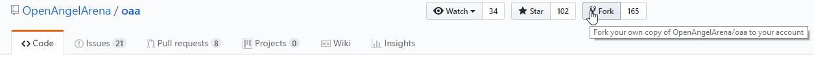

You MUST Fork the OAA repository to your account in order to do any form of development, as new users cannot write directly to the master repository at all.

### Making A Pull Request
> A pull request is the method by which you ask for a set of changes you have made to be integrated into the selected repository.

  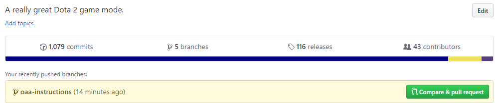
  
  ---
  
  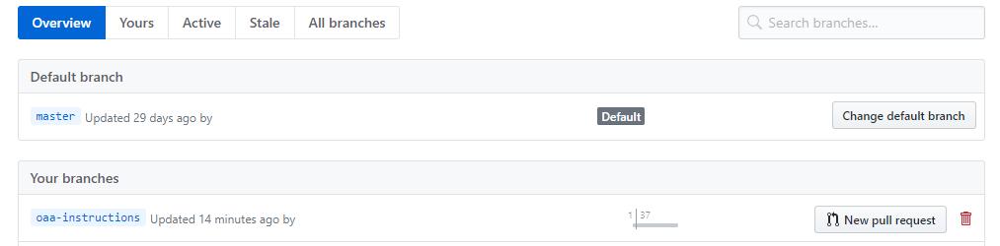
  
Making a pull request starts from the branch where your work is being done in.  You can see any freshly changed branches on your repository fork on GitHub, or you can see it from the branches view, where all branches are listed.
  
  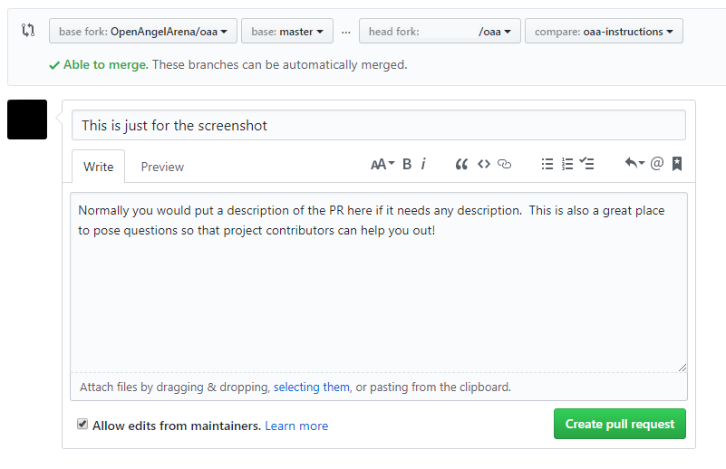

By default, this is the only way to make changes to Open Angel Arena.  This process will integrate directly into any testing capability that has been built for Open Angel Arena, allow project contributors to suggest changes or fixes and allow for general discussion.  A Pull request can only be merge into Open Angel Arena by core contributors.

## Git Basics (Application)

The Windows GitHub client is a good place to view your changes if you are not used to using git through the CLI (There is a CLI walkthrough [here](#manual-installation-of-oaa).  The following will go through the complete process, from the GitHub application, of making a code change and getting it to the point where you may make a Pull Request.

### What the heck is a remote?
>To better aid terminology later on, I am going to take a moment to explain remotes here.  If you understand what a remote is, and their general naming purpose, then you may skip this and move on.

>Remotes are the short term for `Remote Repository` and are used to describe any repository that **IS NOT THE ONE YOU ARE CURRENTLY ON**.

By default, remote repositories in specific relations to the current repository are given very specific names, and their descriptions are as follows:
- **Origin**: The origin remote is the name of the repository that you cloned from.  This, in OAA, is the fork you created when doing the initial setup steps.
- **Upstream**: The upstream remote is the name of the next nearest branch sitting above whatever fork you have created.  This, in most cases, is the actual master repository, but bear in mind that this is not always the case (Especially in large projects with many groups separated into intermediate repositories).

Though these names have special meaning in Git, they are not hard-set, meaning that you may rename remotes as needed if there is a workflow where **Origin** and **Upstream** might cause confusion.  From here on out, I will refer to `Remote Repositories` as simply `Remotes`

### What is a branch and why are you asking me to make one for EVERY FEATURE?
>A branch in Git is simply a lightweight movable pointer to one of these commits. The default branch name in Git is master. As you initially make commits, you’re given a master branch that points to the last commit you made. Every time you commit, it moves forward automatically.

Branches act as a way to maintain several sets of changes to the same repository without them being in the same set of history (And all coming over as a giant clump when a Pull Request is made).  This allows you to make small, specialized sets of changes, additions and fixes without all of them running together when you go to make a Pull Request.  As a good general rule of thumb, you should make a new branch for every new feature, fix or addition and not work on the master branch so you can have a place to start new branches without changes that have yet to be incorporated into Open Angel Arena.

  
Creating a new branch is as simple as going to the text field next to `New`, typing in a name and clicking the new button.  You will be prompted what branch to base your new one on.  Almost every time you get this prompt, `Master` is the branch you want, as other branches may have unmerged changes that you don't want to deal with.

Branches may be published at any time (Sent to GitHub so it may be Pull Requested) by clicking on `Publish branch` in the main bar of the application.

  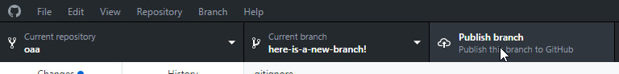
  
### Syncing your master with the master OAA repository

>It is generally a good idea to keep your repository as up-to-date as possible.  This will allow the test suite tools like Travis to better check your code and prevent any problem from showing up as a result of all of the other changes constantly happening.

In order to perform more complex or advanced tasks, you will need to be comfortable with typing commands into the command prompt.  If you are not comfortable with that, then you MUST USE BRANCHES FOR EVERY CHANGE!  If you do not, there is no method in the application to reset those changes away.

  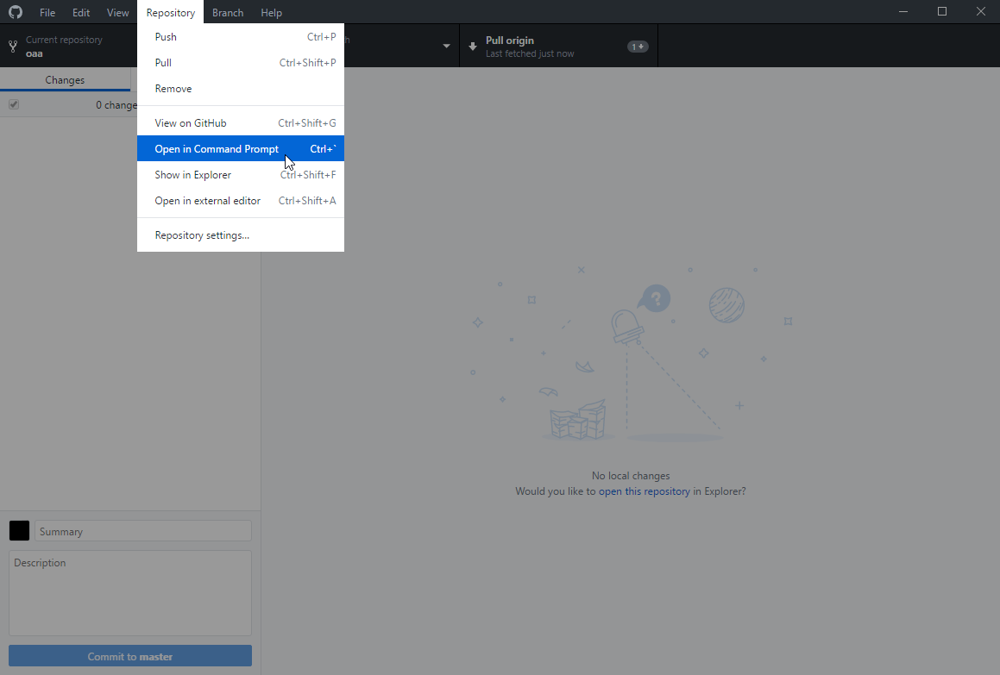
  
Using the menu in the application will open either a PowerShell instance or a command prompt instance in your repository, so you can get to entering commands immediately.  In order to pull the master repository, you can simply run the following:

- `git pull upstream master`

IF YOU ARE NOT ABLE TO PULL, PLEASE SEE THE FOLLOWING SECTION ON RESETTING YOUR BRANCH.

  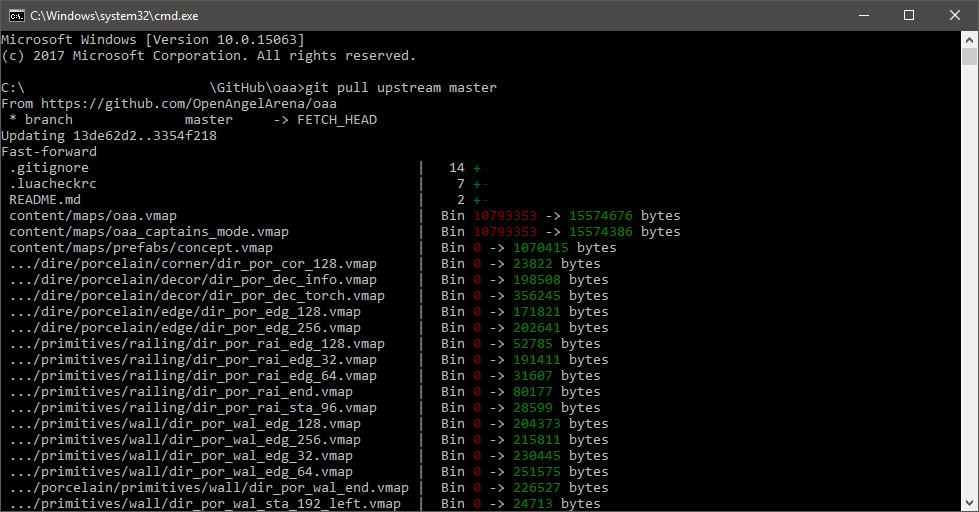
  
  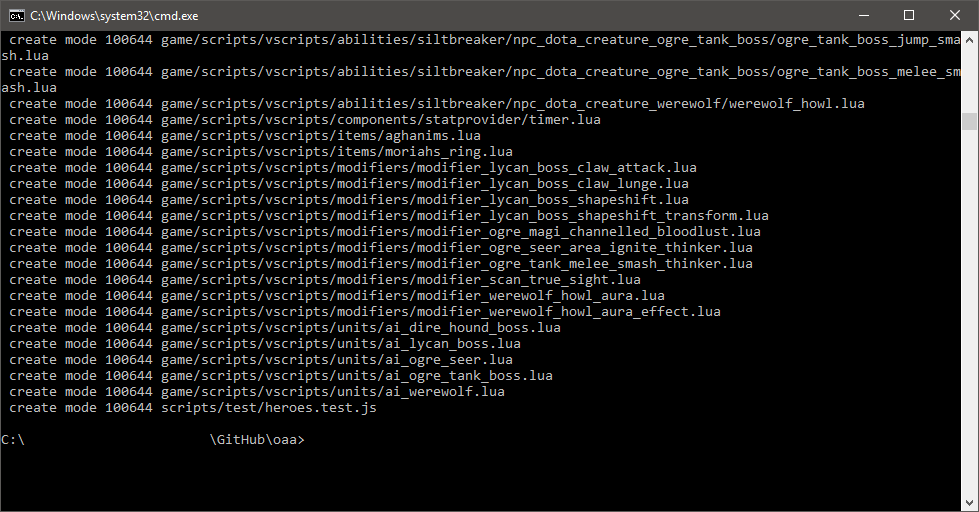
  
The console output will vary, but anything looking even remotely like what is shown indicates there was a success.  Any errors will be stated at the end of the command output.

### Resetting your branch so it is in sync with the master OAA repository
>This process will bring your master branch up-to-date with the master OAA repository, meaning the changes you make will be in the same state as an immediate merge.  This ensures your code will not be as affected by the changes of others.

Resetting your master branch is NOT something that you can accomplish in the application and is NOT a reversible process.  Once reset, any changes you have made on your master branch are gone.  open up the command prompt in the same manner that is shown from the application in the above section and run the following commands IN ORDER:

- `git fetch upstream master`
- `git reset --hard upstream master`

  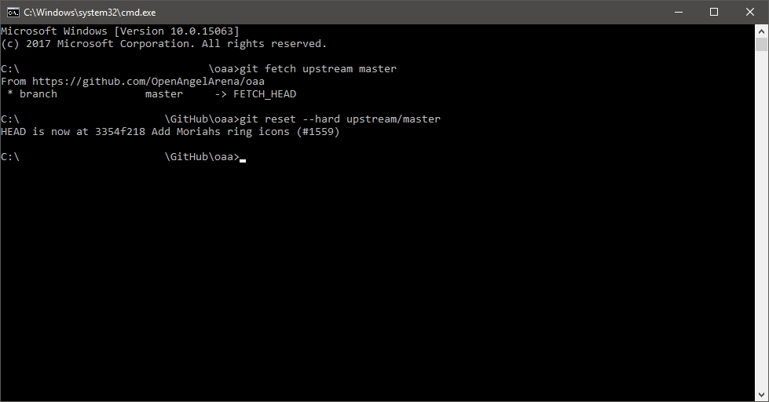

### Viewing the changes you have made

  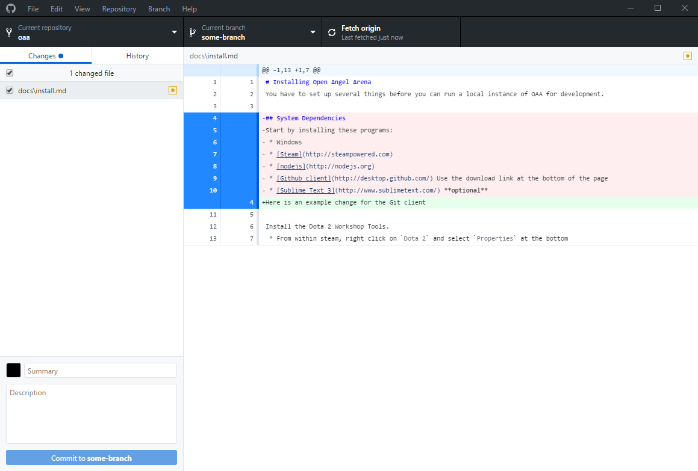

By default, the changes you have made to OAA will show up in the application window under the `Changes` list.  When viewing changes, red indicates items that have been removed, green indicates items that have been added and yellow indicates items that have been modified (All 3 are visible in the screenshot.  There were lined added and removed from a file, which had been modified).

  
  
There is a right-click menu of options that you have on the files list if you need to make additional changes or slight amendments to files.  This is not the best way to actually modify files, as **ONLY CHANGED FILES WILL SHOW UP**, but it is good to be able to correct a mistake before making a commit.  Please keep in mind that, unless you want to learn the command line interface, **commits are FINAL**.

  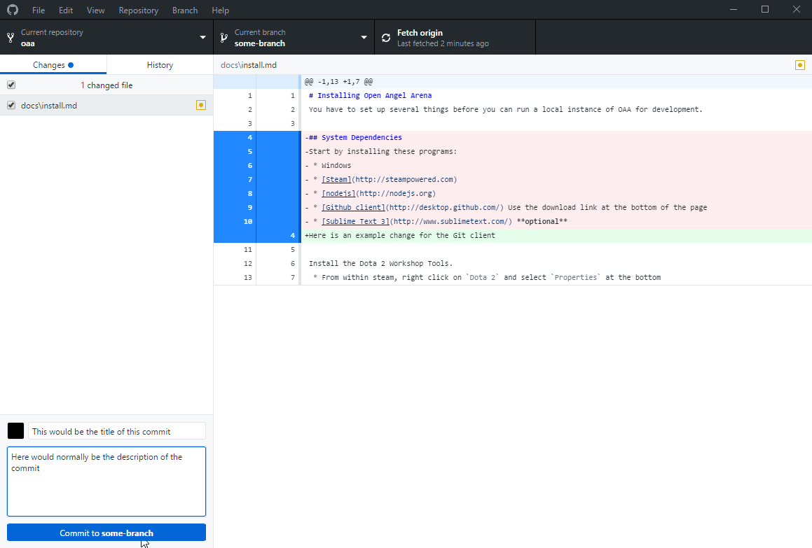
  
At the bottom left you have 2 text fields, one for a tittle and one for a description.  As a general rule of thumb, commit titles should be a very brief title for the purpose of a commit, like `Fix T1 core drops`.  The description is where you can get a bit more detailed if there is something that other developers need to be aware of.  In general this should be reserved for things like internal API changes and modifications that could break things for other people.  **Please do not re iterate what your code change does in the description.  If your code is straight forward or easy to look at and understand, putting a detailed description does not help you**

  
  
One a commit has been made, you will normally be automatically be taken to the `History` tab within the application.  This will allow you to see the commits and changes leading up to the latest commit made (There is a limit to the number of commits you can see.  If you need to look at a very old commit, please use the tools on the website).

  

The repository menu up at the top bar of the application has several commands that will be of use when pushing and/or pulling code from Remotes.

- `Push` - This will attempt to push commits that have been made up to the remote you specify.
- `Pull` - This will attempt to pull, meaning to retrieve and incorporate, changes into the current branch.
- `Remove` - This will delete the repository.

- `View On GitHub` - This will open up the Fork you have created for yourself in your default Internet Browser.
- `Open in Command Prompt` - This will open up a Command Prompt window (Or PowerShell if you shoce PowerShell as the default command prompt during installation).
- `Show in Explorer` - This will open up the folder where the repository lives on your machine.
- `Open in External editor` - This will attempt to open up a program for editing the project.  By default, this will try to find Atom.

- `Repository Settings` - This will open a dialogue for modifying certain aspects of the Repository.

  
  
Once the application starts up, the origin Remote will have a quick-action button associated with it.  From here you can easily Fetch (Look for changes), pull and push to the Remote with a click.

  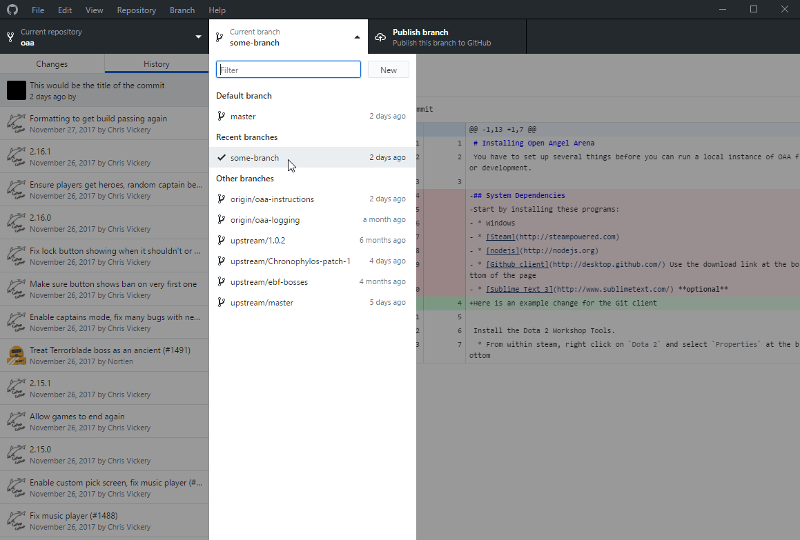
  
There is an easy link menu for going directly to the `Create a Pull Request` page on GitHub for the branch you are currently on.  The behavior of this is very contextual depending on a LOT of factors (The upstream Remote state, the origin Remote state and the branch state), so I will not go over what it will do once opened.

  
  
There is also a dialogue for creating and managing branches within your repository.  Use branches as a way of isolating features or other changes away from one another (Try to keep your work precise to what you want to fix.  It is generally bad practice to do a combination of fixes, features and tweaks that a completely unrelated in the same branch.  There is a point to doing several changes in one branch at once when it makes sense, such as a set of changes and tweaks to address a particular problem.  In that case, having many separate changes in one branch is fine.)

## Installing OAA
### Find where the DOTA 2 beta is installed

The DOTA 2 beta (Normal and Test/Tools clients) are found in the same menu as mentioned in the required software section for the DOTA 2 Tools client [Linked here for your convenience](#2-dota-2-workshop-tools).  Instead of going to `DLC`, however, head over to `Local Files` and click on `BROWSE LOCAL FILES...`.

  
  
  
  
COPY THIS PATH!  You MUST know where your DOTA 2 installation is in order to clone the repository locally later and to run the initial setup commands.  **DO NOT ASSUME THE SHOWN PATH IN THE IMAGE IS CORRECT!**

### Clone Open Angel Arena into the addons folder

- Fork the Open Angel Arena Repository
- Launch your GitHub Client (And log into it)
- Click `Clone a repository`
  
- Select your Open Angel Arena fork and be sure to set the `Local Path` to where your DOTA 2 beta folder is (And in the addons directory)
  
- Click `Clone` and let the process complete

### Open Up Command Prompt (PowerShell will also work and is preferred if you can use PowerShell)

- NOTE: If your DOTA 2 client is NOT installed on your default drive (Usually `C:\`), then start by running the following command `cd G:\` Where `G` is replaced by the drive letter you need to change to.
- Run the following in your command prompt (Or PowerShell).
  - `cd "SOME_PATH"` Where `SOME_PATH` is replaced by the location where Open Angel Arena was cloned to
  
  
  
- Once in the correct directory, run the following commands IN ORDER
  - `npm install -g dota2-addon-manager`
  - `cd ../../` (This gets you into the base `dota 2 beta` directory)
  - `d2am link` (This will write to the console some, that is normal.  The screenshot shows nothing due to circumstances outside of the normal installation)
  - `d2am list`
  - `cd "SOME_PATH"` Where `SOME_PATH` is replaced by the location where Open Angel Arena was cloned to
  - `npm install` (This command can take a bit to run, please be patient)
  
  

### Check tools mode

- Go into `community` -> `library` -> `games` -> `DOTA 2` (This is the same menu you have used for getting to the properties to install the tools client)
- In that right click menu NEAR THE TOP, is `Launch DOTA 2 - Tools`.  Click this option
- If all of the above installation has worked, you should see the Open Angel Arena directory name without a lock next to it in the custom games selection

  

## Manual installation of OAA
### CLI installation

This portion of the documentation assumes that you already know where to put the repository and that you know enough to set up git CLI.  As a result, the specifics on how to use the credential management system within Git or access tokens are **NOT** going to be covered.  There is also no accommodation to installing Git CLI for global use on your system, as that is also expected to have already been done for this process.

The following steps are assumed to be run IN ORDER!

- Inside of where your DOTA 2 installation is, go into `addons` and create a folder (This will be where your repository will be, for the sake of this documentation, we will assume the folder name is `oaa`)
- Open up a command prompt (Administrative privileges are generally not needed, but be aware of how to handle this is your system configuration demands elevation)
- Run `cd "SOME_PATH"` Where `SOME_PATH` is replaced by the location of your DOTA 2 installation
- Run `cd ./addons/oaa/`
- Run `git init`
- Run `git clone {Your Fork URI}` (This can take a bit, please be patient)
- `npm install -g dota2-addon-manager`
- `cd ../../` (This gets you into the base `dota 2 beta` directory)
- `d2am link` (This will write to the console some, that is normal.  The screenshot shows nothing due to circumstances outside of the normal installation)
- `d2am list`
- `cd ./addons/oaa/`
- `npm install` (This command can take a bit to run, please be patient)

### Manual linking (If `d2am link` failed)

This part assumes you ALREADY have the command prompt to your DOTA 2 addons directory.  This also assumes you know where your repository was cloned to and can open up the file explorer there.  Creating the hard links USUALLY requires administrative privileges, so please be aware of how to launch a command prompt as an administrator.

**DO NOT DO THIS UNLESS YOU HAVE ISSUES WITH D2AM LINK AND PLEASE CONTACT THE DEVS ON DISCORD BEFORE TRYING THIS.  There are many issues that can be resolved with simple fixes if D2AM is failing before trying to make these hardlinks manually.**

- Open up your file explorer and delete the following folders from your repo if they exist: `content` and `game`.  These folders will be replaced by hard links.
- Go over to your command prompt and do the following IN ORDER.
- `cd C:\Windows\System32` (Yes, I know this isn't where OAA is, but you cannot normally make links from anywhere else)
- `mklink /J "{PATH_TO_OAA_REPO}/content" "{PATH_TO_DOTA_ADDONS}/oaa/content"` Where `PATH_TO_OAA_REPO` the the full SYSTEM path to the OAA repository directory.  Where `PATH_TO_DOTA_ADDONS` is the `content/dota_addons` directory in your DOTA 2 installation folder
- `mklink /J "{PATH_TO_OAA_REPO}/game" "{PATH_TO_DOTA_ADDONS}/oaa/game"` (See above for references)

[[0]: README.md](./README.md)
